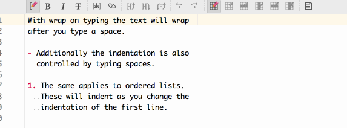
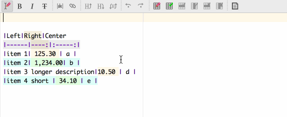
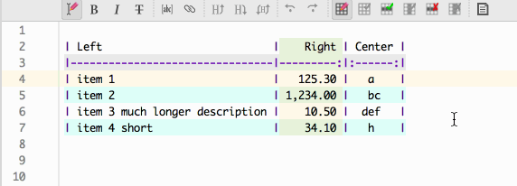
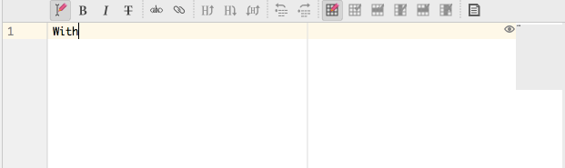

[TOC]: #
# Table of Contents
- [Split Layout Control](#split-layout-control)
- [Live Templates](#live-templates)
- [As You Type Enhancements](#as-you-type-enhancements)
    - [Wrap on Typing](#wrap-on-typing)
    - [Auto-format table](#auto-format-table)
    - [Bold, Italic, Strikethrough](#bold-italic-strikethrough)
    - [Copy/Paste](#copypaste)
    - [Table Of Contents](#table-of-contents)


* * *

## Split Layout Control


| Button                                                                            | Action                                 | Notes                                               |
|:----------------------------------------------------------------------------------|:---------------------------------------|:----------------------------------------------------|
|    | Show editor and preview                |                                                     |
|        | Show preview only                      |                                                     |
|          | Show editor only                       |                                                     |
|        | Show HTML preview                      |                                                     |
|      | Show HTML text used for browser        |                                                     |
|  | Show plain HTML as generated by parser | Plain HTML as converted from markdown by the parser |

Actions available but not in the toolbar. Can be mapped to shortcuts.

| Non Toolbar Actions                                                                           | Action                | Notes                                                             |
|:----------------------------------------------------------------------------------------------|:----------------------|:------------------------------------------------------------------|
|    | Cycle split layout    |                                                                   |
|  | Toggle Editor Layout  | toggles preview on/off                                            |
|                        | Cycle preview content | cycle through preview, modified and unmodified HTML preview types |


| Button                                                                                                               | Action                     | Notes                                                                                                                          |
|:---------------------------------------------------------------------------------------------------------------------|:---------------------------|:-------------------------------------------------------------------------------------------------------------------------------|
|                | Toggle wrap on typing      |                                                                                                                                |
|                                    | Toggle bold text           |                                                                                                                                |
|                                | Toggle italic text         |                                                                                                                                |
|                 | Toggle strike through text |                                                                                                                                |
|                          | Toggle code span           |                                                                                                                                |
|                              | Insert explicit link       |                                                                                                                                |
|                    | Decrease quote level       |                                                                                                                                |
|                          | Increase quote level       |                                                                                                                                |
|              | Increase header level      |                                                                                                                                |
|          | Decrease header level      |                                                                                                                                |
|        | Toggle header type         |                                                                                                                                |
|                  | Un-Indent list item        |                                                                                                                                |
|                      | Indent list item           |                                                                                                                                |
|                        | Single space list          | Single space all items in a list. Caret placed on one of the list items                                                        |
|                        | Double space list          | Double space all items in a list. Caret placed on one of the list items                                                        |
|          | Bullet list                | Convert caret item or items in selection  to bullet list items. If all are already bullet items then convert to plain text     |
|        | Numbered list              | Convert caret item or items in selection  to numbered list items. If all are already numbered items then convert to plain text |
|              | Task list                  | Convert caret item or items in selection  to task list items. If all are already task items then convert to plain text         |
|  | Toggle task item done      | Toggle done status of caret item or items in selection                                                                         |
|                          | Toggle auto-format table   | Toggle format table as you type mode.                                                                                          |
|                    | Insert table               | Inserts a 1x3 table that you can edit to add more rows and columns.                                                            |
|            | Insert table row           | Insert a row below the caret. Also done by <kbd>ENTER</kbd>                                                                    |
|      | Insert table column        | Insert a column left of the column with caret.                                                                                 |
|                           | Delete table row           | Delete the row with the caret. Also done by <kbd>ENTER</kbd>                                                                   |
|                     | Delete table column        | Delete the column with the column with caret.                                                                                  |
| ![Editor Actions Reformat Element]                                                                                   | Reformat current element   | Wrap paragraph, format table or update table of contents element                                                               |
| ![Editor Actions Reformat Document]                                                                                  | Reformat current document  | Apply code style to current document                                                                                           |
|                          | Copy JIRA formatted text   | Copy current selection or document as JIRA formatted text                                                                      |
|                      | Export Rendered Html       | Export rendered HTML as per rendering profile                                                                                  |

## Live Templates

| Element           | Abbreviation    | Expansion                                               |
|:------------------|:----------------|:--------------------------------------------------------|
| Abbreviation      | `.abbreviation` | `*[]: `                                                 |
| Code fence        | `.codefence`    | \`\`\` ... \`\`\`                                       |
| Emoji             | `.emoji`        | `::`                                                    |
| Explicit link     | `.link`         | `[]()`                                                  |
| Footnote          | `.footnote`     | `[^]: `                                                 |
| Footnote Ref      | `.rfootnote`    | `[^]`                                                   |
| Image             | `.image`        | ``                                                 |
| Ref image         | `.rimage`       | `![][]`                                                 |
| Ref link          | `.rlink`        | `[][]`                                                  |
| Reference         | `.reference`    | `[]: `                                                  |
| Table             | `.table`        | <pre><code>`|   |`&#10;`|---|`&#10;`|   |`</code></pre> |
| Task              | `.task`         | `- [ ] `                                                |
| Table of Contents | `.toc`          | `[TOC]: #`                                              |
| Wiki link         | `.wikilink`     | `[[]]`                                                  |

## As You Type Enhancements

### Wrap on Typing

With `Wrap on typing` option enabled, typing in a text block will
re-format the text block when a space is typed and the line containing
the caret extends beyond the current right margin. The limitation on
when wrapping is done is intended to reduce the overhead and delay when
typing.

<kbd><kbd>BACKSPACE</kbd></kbd> will reformat the paragraph every time.

Additionally, typing/backspacing a space or a block quote `>` before the
first character of a paragraph will optionally match the block quote
markers and indentation on all the continuation lines for the paragraph.

Similarly, typing between a list marker and the first character of the
paragraph will optionally indent the continuation lines to line them up
with the first position of the text on the first line.



### Auto-format table

With `Auto-format table on typing` enabled will result in the table
formatting options being applied as you edit the table. This does delay
the typing but does make it easier to see the results. When performing
extensive edits to a table you can temporarily turn off this options on
the toolbar.



If `Add missing columns` is enabled the typing before the leftmost pipe
character will insert a column into the table before the first column.
Typing after the rightmost pipe character will add a column after the
last. If the table rows have un-even column numbers then reformatting a
table via the `Format element` button will also add columns but will do
so at a location based on the column that contains the caret. This way
you can control where the missing columns are inserted. For full control
you should use the `Insert table column` button.

Delete empty row/col on backspace will automatically delete a row or
column when <kbd>BACKSPACE</kbd> is performed in an empty row/column.
Row deletion has priority over column deletion.

Insert on <kbd>ENTER</kbd> will add an empty table row below the row
that contains the caret.



### Bold, Italic, Strikethrough

Automatic closing of bold, italic and strikethrough markers can be
turned on in <kbd>Editor > Code Style > Markdown</kbd>. Enabling each
option will add a closing character. If however you type a space after
the initial character then the added closing one will be removed.



### Copy/Paste

When pasting markdown text copied from a markdown file link and footnote
references will automatically paste the references at the end of the
file so that these references resolve in the destination file.

Links and link references will also be adjusted to reflect the change in
the source reference file. The destination link address format will be
changed to absolute URL format if the destination file link cannot be
resolved in the original link format.

### Table Of Contents

Table of contents for your document can be generated for standard
markdown parsers that do not support a table of contents element.

The lines after the `[TOC]: #` tag are updated to reflect the content of
the document when you reformat document
![Editor Actions Reformat Document] or reformat element
![editor actions reformat element]. More details in
[[Adding a Table of Contents]]

For a toc element `[TOC levels=3]: #### "Table of Contents"` and these
headers in the document:

```markdown
# Heading **some bold** 1
## Heading 1.1 _some italic_
### Heading 1.1.1
### Heading 1.1.2  **_some bold italic_**
# Heading 2
### Heading 2.0.1
```

After an update the table of contents element will look like the
following:

**Markdown version:**

```markdown
[TOC levels=1-3]: #### "Contents"

#### Contents
- [Heading **some bold** 1](#heading-some-bold-1)
    - [Heading 1.1 _some italic_](#heading-11-some-italic)
        - [Heading 1.1.1](#heading-111)
        - [Heading 1.1.2  **_some bold italic_**](#heading-112--some-bold-italic)
- [Heading 2](#heading-2)
    - [Heading 2.0.1](#heading-201)
```

#### Contents

- [Heading **some bold** 1](#heading-some-bold-1)
    - [Heading 1.1 _some italic_](#heading-11-some-italic)
        - [Heading 1.1.1](#heading-111)
        - [Heading 1.1.2  **_some bold italic_**](#heading-112--some-bold-italic)
- [Heading 2](#heading-2)
    - [Heading 2.0.1](#heading-201)

* * *

**HTML version:**

```markdown
[TOC levels=1-3]: #### "Contents"

<div><h4>Contents</h4>
  <ul>
    <li><a href="#heading-some-bold-1">Heading <strong>some bold</strong> 1</a>
    <ul>
      <li><a href="#heading-11-some-italic">Heading 1.1 <em>some italic</em></a>
      <ul>
        <li><a href="#heading-111">Heading 1.1.1</a></li>
        <li><a href="#heading-112--some-bold-italic">Heading 1.1.2  <strong><em>some bold italic</em></strong></a>
      </ul></li>
    </ul></li>
    <li><a href="#heading-2">Heading 2</a>
    <ul>
      <li><a href="#heading-201">Heading 2.0.1</a></li>
    </ul></li>
  </ul>
</div>
```

<div><h4>Contents</h4>
  <ul>
    <li><a href="#heading-some-bold-1">Heading <strong>some bold</strong> 1</a>
    <ul>
      <li><a href="#heading-11-some-italic">Heading 1.1 <em>some italic</em></a>
      <ul>
        <li><a href="#heading-111">Heading 1.1.1</a></li>
        <li><a href="#heading-112--some-bold-italic">Heading 1.1.2  <strong><em>some bold italic</em></strong></a>
      </ul></li>
    </ul></li>
    <li><a href="#heading-2">Heading 2</a>
    <ul>
      <li><a href="#heading-201">Heading 2.0.1</a></li>
    </ul></li>
  </ul>
</div>

[Editor Actions Reformat Document]: ./resources/icons/editor_actions/Reformat_document%402x.png
[Editor Actions Reformat Element]: ./resources/icons/editor_actions/Reformat_element%402x.png

